街机游戏舞萌在个人计算机上的逆向修复游玩教程
以前在游戏群里写的一个分析，重新发一下。

1.解包

游戏本体为一个.app的超大文件，存放在给游戏厅的u盘里或者通过世嘉自己开发的专用allsnet网络分发至街机框体的电脑里。玩过世嘉游戏的都知道，这是他们游戏打包的特点。加密算法为AES128。感谢elorg的国外游戏爱好者，向本仓库上传了密钥的详情。详情查看本仓库文件。

解密后为两级目录树，后缀为vhd。一级为私有格式包，需要通过虚拟机模拟器模拟环境来挂载访问。以下为在Linux里使用qemu-nbd指令挂载。
sudo modprobe nbd  
sudo qemu-nbd -c /dev/nbd0 "youfilename.vhd"  
sudo mount /dev/nbd0 /mnt  
再复制/mnt/VHD/大概叫internal_{N}.vhd后进行解压即可。

继续分析其文件头与信息，conectix开头为第二级，eb5290NTFS开头为第一级（用旧版中二节奏游戏的信息举例）：

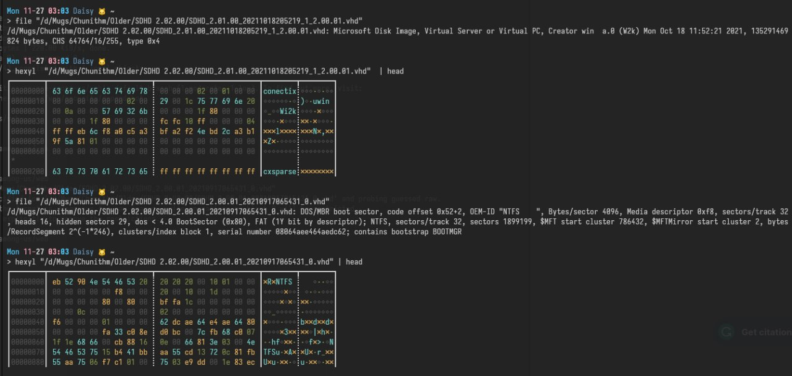

有报错，fdisk不是很兼容，需要给fdisk添加兼容源码重新编译。先不管。

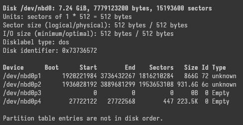

2.脱壳

查看游戏本体得知为unity游戏，带壳，直接运行Sinmai.exe主程序会闪退。先用die主程序，显示为HyperTech Crackproof 工具加密 (aka. “Htpac”)。

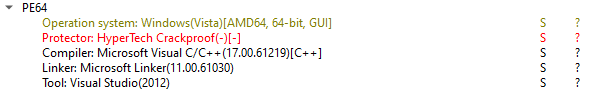

主程序启动器非通用unity启动模板主程序，所以需要继续修复。用diec扫描目录中所有exe和dll，找到四个加密过的unity编写的文件：

amdaemon.exe
Sinmai_Data/Managed/Assembly-CSharp.dll
Sinmai_Data/Plugins/Cake.dll
Sinmai_Data/Plugins/amdaemon_api.dll

使用本仓库的街机游戏脱壳专用工具DecryptCrackproof 的工具，脱壳amdaemon.exe。

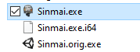

本游戏的加密DLL无法使用，有CRC32out of range of valid values报错。因为dll是HyperTech的另一种新加密算法，从堆栈跟踪可以看出传给CalcChecksum的参数是UInt32，而CRC32函数接收的参数是Int32，单纯用类似DotPeek的ide反编译后进行调试就知道，并不是长度超过Int32最高值，而是超过整个文件的长度，请求长度通过一串非标准计算得出。该工具的算法没有对dll额外兼容。

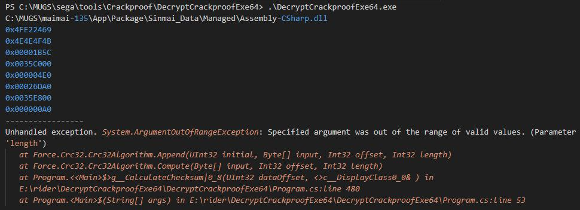

本来继续分析需要导出和分析虚拟机内存里的游戏，详情参考https://github.com/rakisaionji/iatrepair 。不过这一方面也可以不用费劲重新实现街机定制的附加硬件和win系统以及街机额外程序，在网上搜索街机系统附加的odd.sys文件，用OSRLoader加载系统即可启动，不过amdaemon还没修复，所以会黑屏。

用IDA Pro打开驱动查看解密代码是否在驱动里面，不过只有一些hashing的PID验证和字符串处理，返回一个处理过的字符串，得出驱动的作用是让用户进程上传识别信息来生成真正解密密钥的工具。

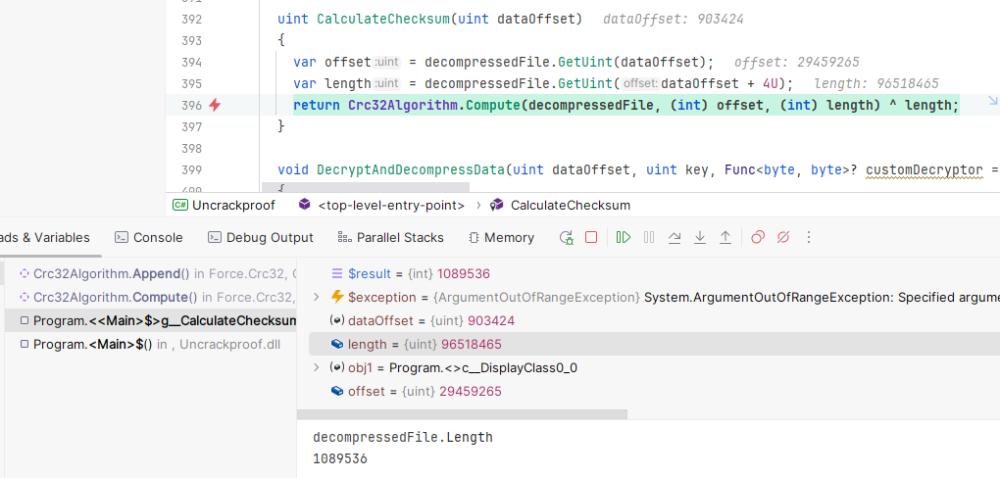

由于反汇编寻找解密代码再重新实现很复杂，所以先直接从内存找。

打开CheatEngine查看内存，启动游戏。报错调试器无法附加游戏。打开设置-调试器选项-开启DBVM内核驱动模式，再把Extras里的用内核模式浏览内存选上即可。

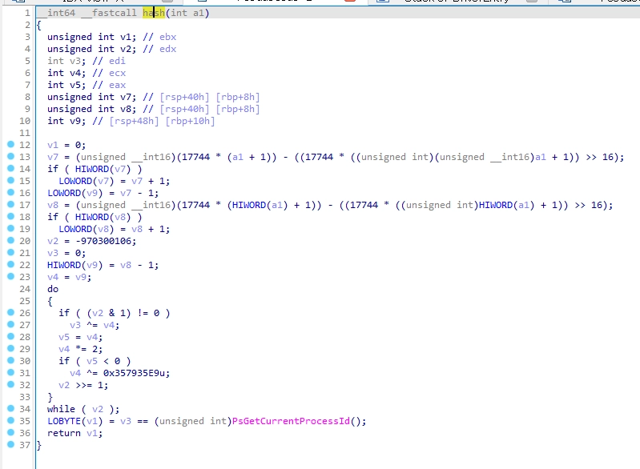

打开内存视图，查看Memory Regions中标注的DLL 名，没有找到。先看看有没有只属于这个DLL的可识别信息。用hexed.it打开那位爱分享的音游爱好者分析好的中二节奏的Assembly-CSharp.dll，得到文件末尾的元信息，内容为"InternalName Assembly-CSharp.dll"，每个字符中间间隔着一个NULL \0 字符。

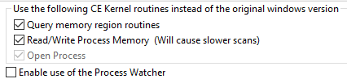

从CE内存视图中搜索这段文字即可。记录最左边的地址，打开内存区域视图找到这个地址所属的区域，右键存储整个区域，用hexed.it打开，把CE的文件头去掉（截到 DLL 文件头那里）再把文件尾补到整32位，保存改名成DLL即可修复Assembly-CSharp.dll。

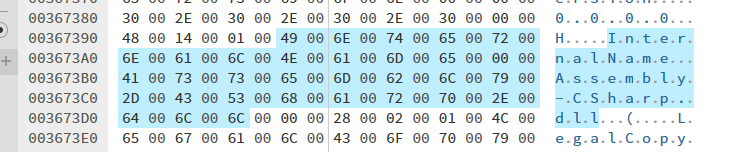

Cake.dll和amdaemon_api.dll比较复杂，amdaemon_api在游戏里并没有加载，而Cake是一个包含了依赖的dll，被拆成了很多不同的内存区域，导致重新整合比较困难。不过这两个文件在世嘉游戏的不同版本中几乎没有改动，所以直接使用那位音游爱好者提供的旧中二节奏游戏已经脱好壳的用就可以（详情各个segatools仓库）。

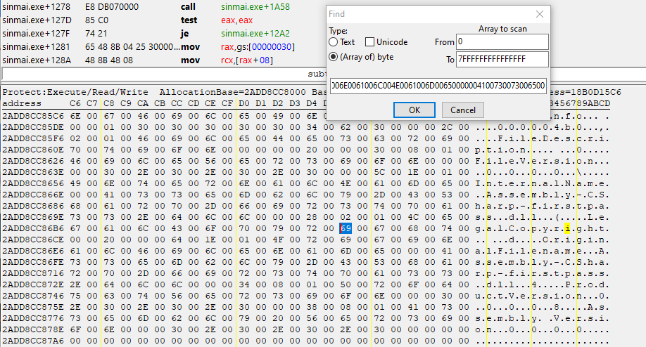

3.运行

世嘉在游戏编译上比较友好，为mono编译。Assembly-CSharp包含了世嘉额外添加的街机验证代码，不过通过反编译为源码，再修改报错代码和去除验证，重新编译即可。该文件在世嘉所有游戏中也没有什么改动，还是同上使用elorg的音游爱好者提供的即可。修复完即可进入游戏。

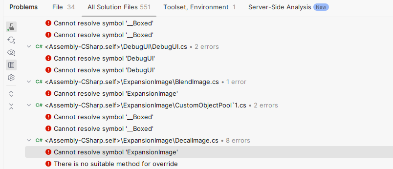
